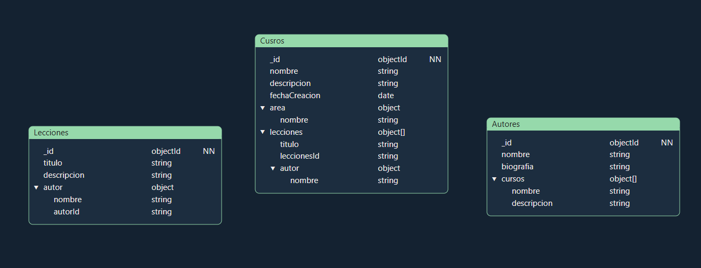

# Enunciado

Una startup tecnológica va a desarrollar un portal de ELearning y nos ha pedido que realizamos el modelo de datos de dicho sistema.

**A tener en cuenta:**

- Va a ser un portal orientado al mundo de la programación.
- El portal va a estar compuesto por cursos, cada curso está compuesto a su vez por un número de videos y artículos que lo acompañen.
- Lá página de cursos debe mostrar la lista de autores que lo hicieron.
- Lá página de un video debe mostrar el autor que lo realizó.
- Los videos y el contenido de cada artículo se almacenan en un storage S3 y en un headless CMS, en la base de datos sólo almacenaremos los Id's a esos recursos.
- Los videos se pueden clasificar por temáticas (Devops / Front End / Back End / ...)
- Los videos tienen autores (ponemos la restricción, un video tiene un autor), un curso puede tener varios autores.
- En principio los vídeos no se van a compartir entre diferentes cursos aunque sería una amplicacíon interesante del ejercicio.
- Hay una opcíon para ver la página con la biografía del autor, esta página no va a ser muy visitada.

## Parte obligatoria
Generar un modelado que refleje los siguiente requerimientos:

- Queremos mostrar los últimos cursos publicados.
- Queremos mostrar cursos por área (devops / front End ...).
- Queremos mostrar un curso con sus videos.
- En un video queremos mostrar su autor.

### El planteamiento quedaria de la siguiente manera

#### Colecciones y patrones utilizados:

- Cursos: contiene la información necesaria de los cursos
  - id
  - nombre
  - descripción
  - fechaCreación: para poder mostrar la fecha y buscar por ella
  - area: de tipo object para la categoria
  - lecciones: de tipo object array para mostrar las lecciones/videos del curso
  - autor

- Lecciones: contiene la informacion de los videos
  - id
  - titulo
  - descripcion
  - autor: de tipo object para poder mostrar el autor de los videos

- Autores: con la información mas detallada de los autores y sus cursos
  - id
  - nombre
  - biografia
  - cursos: de tipo object array para poder mostrar los cursos del autor